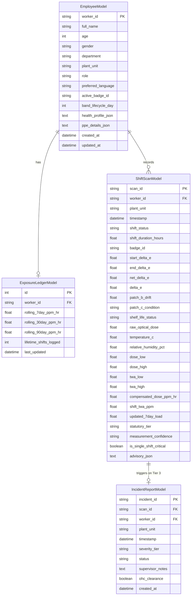

# Backend Audit — Rakshak / H₂S Monitoring Platform

**Date:** 2026-09-02  
**Target Backend:** FastAPI on `http://127.0.0.1:8000`  
**Database:** SQLite (`rakshak.db` with WAL mode) / PostgreSQL compatible  

---

## 1. Executive Summary

The SIH H₂S platform backend (code-named **Rakshak / रक्षक**) is implemented in Python using FastAPI, SQLAlchemy, and Pydantic. It provides deterministic optical dosimetry calculation, rolling worker exposure ledgers (7-day, 30-day, 90-day), image-based wristband analysis with a 3-layer MLP neural network, real-time Server-Sent Events (SSE), and a Groq-powered multi-turn safety chatbot with static protocol fallback.

---

## 2. Existing Core Components & Services

| Module | Location | Purpose & Capabilities |
| :--- | :--- | :--- |
| **FastAPI App** | `backend/main.py` | API routing, Jinja2 template mounting, CORS, lifespan startup seeding |
| **Database Models** | `backend/database/models.py` | `EmployeeModel` (`workers`), `ExposureLedgerModel`, `ShiftScanModel`, `IncidentReportModel` |
| **Database Engine** | `backend/database/db.py` | SQLAlchemy engine with SQLite WAL pragmas, thread safety, and auto-seeding |
| **Statutory Engine** | `backend/engine/statutory.py` | Zero-LLM deterministic kinetics, differential shift dose calculation, statutory risk tiering (Tier 1/2/3) |
| **Vision Scanner** | `backend/engine/vision_scanner.py` | Image QC, blue substrate validation, QR decoding, CIELAB ΔE calculation, 3-layer MLP neural network inference |
| **Exposure Ledger** | `backend/engine/ledger.py` | Multi-window rolling exposure ledger updates (7d, 30d, 90d ppm·hr) |
| **Weather / Telemetry** | `backend/engine/weather.py` | Contextual environmental telemetry (temperature, humidity) from Open-Meteo |
| **Event Bus** | `backend/engine/event_bus.py` | In-memory pub/sub broadcasting events to `/api/realtime/stream` |
| **Unified Chatbot** | `backend/agents/unified_chat.py` | Bilingual (English/Hindi) multi-turn conversational AI with RAG and safety locks |
| **Advisory Engine** | `backend/agents/advisory.py` | Structured Pydantic LLM advisory generation using Groq (`qwen/qwen3.8-27b`) with static fallback |
| **Intelligence** | `backend/intelligence/` | 2D Leak Triangulation, Neuro Screener, Lung Risk Index, OISD Form-A PDF generation |

---

## 3. Database Schema Overview

---

## 4. Authentication & Session Strategy

- **Session Type:** Cookie-based session (`rakshak_session` cookie containing serialized JSON payload).
- **Supported Roles:**
  - `EMPLOYEE` (default seed: `EMP-1042`, Rajesh Kumar)
  - `MANAGER` (default seed: `MGR-01`, Vikram Singh)
  - `HSE_OFFICER` (default seed: `HSE-01`, Dr. Ananya Sharma)
- **Endpoints:**
  - `POST /api/auth/demo-login`: Instant 1-click role activation for hackathon demo mode.
  - `POST /api/auth/login`: Standard username/password login route (maps username prefix to role).
  - `GET /api/auth/me`: Current session inspection.
  - `POST /api/auth/logout`: Deletes `rakshak_session` cookie.

---

## 5. Integration Mapping

| Capability Required | Existing Backend Implementation | Adaptation / Handling in Next.js Frontend |
| :--- | :--- | :--- |
| **Worker Profile** | `GET /api/manager/employees/{id}` | Direct proxy to backend; renders longitudinal exposure charts & shift history |
| **Roster Listing** | `GET /api/manager/employees` | Direct proxy; searchable/filterable workforce table |
| **Dashboard KPIs** | `GET /api/manager/dashboard` | Direct proxy; workforce metrics & unit breakdown |
| **Band Scanner** | `POST /api/scan/analyze-image` | HTML5 Camera stream capture + file upload; sends image blob; parses QR & ΔE |
| **Start Shift** | `POST /api/scan/start-shift` | Sends baseline ΔE & worker ID; sets shift state to ACTIVE |
| **End Shift** | `POST /api/scan/end-shift` | Sends end ΔE, Patch B/C integrity; computes differential dose & updates ledger |
| **Realtime Updates** | `GET /api/realtime/stream` | Server-Sent Events (SSE) `EventSource` in React hook |
| **AI Assistant** | `POST /api/chat` | Groq RAG chatbot with contextual drawer & guided help fallback |
| **Spatial Leak Map** | `GET /api/manager/heatmap` | 2D refinery unit coordinate heatmap rendering |
| **Incident Reports** | `GET /api/manager/incidents` | Incident table with 1-click PDF download link (`/api/manager/incident-pdf/{id}`) |
| **Band Lookup** | Image QR or manual worker ID | Client-side resolution using `GET /api/manager/employees/{id}` |
